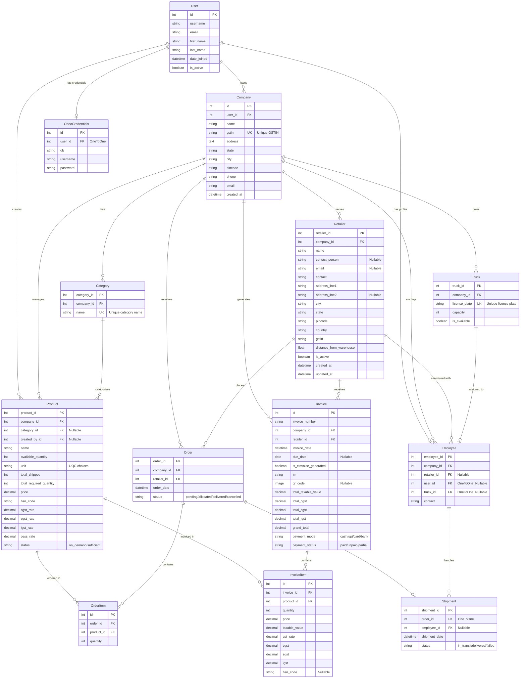

# Entity-Relationship Diagram (ERD) - Vendor Management System

## Database Schema Overview

This ERD represents the complete database structure for the Vendor Management System built with Django.

## Key Relationships & Business Logic

### 1. **User Management**
- **User** → **Company**: One user can own multiple companies
- **User** → **Employee**: One-to-one relationship for employee profiles
- **User** → **OdooCredentials**: One-to-one for Odoo integration
- **User** → **Product**: Tracks who created each product

### 2. **Company Structure**
- **Company** is the central entity that owns:
  - Categories and Products
  - Retailers and Orders
  - Trucks and Employees
  - Invoices

### 3. **Product Management**
- **Category** → **Product**: Optional categorization
- **Product** has inventory tracking fields:
  - `available_quantity`: Current stock
  - `total_required_quantity`: Total demand
  - `total_shipped`: Total delivered
  - `status`: Auto-calculated (sufficient/on_demand)

### 4. **Order Processing Flow**
- **Retailer** → **Order** → **OrderItem** → **Product**
- **Order** → **Shipment** (One-to-one)
- **Employee** → **Shipment** (Employee handles delivery)
- **Truck** → **Employee** (One-to-one assignment)

### 5. **Invoicing System**
- **Invoice** → **InvoiceItem** → **Product**
- Invoice has comprehensive tax calculations (CGST, SGST, IGST)
- Unique constraint on (`invoice_number`, `company`)

### 6. **Shipment & Delivery**
- **Shipment** automatically updates:
  - Order status to 'delivered'
  - Product quantities (reduces required, increases shipped)
  - This is handled in the `Shipment.save()` method

## Database Constraints

### Unique Constraints
- `Company.gstin`: Unique GST identification
- `Category.name`: Unique category names
- `Truck.license_plate`: Unique truck identification
- `Invoice`: Unique (`invoice_number`, `company`) combination

### Foreign Key Relationships
- Most entities are company-scoped for multi-tenancy
- Soft relationships with nullable foreign keys where appropriate
- Cascade deletions configured to maintain data integrity

## Business Rules Implemented

1. **Inventory Management**: Product status auto-updates based on available vs required quantity
2. **Order Fulfillment**: Shipment delivery automatically updates order status and product quantities
3. **Multi-tenancy**: Company-based data isolation
4. **Tax Compliance**: Comprehensive GST tax structure support
5. **Resource Assignment**: One-to-one truck-employee assignment

This ERD represents a comprehensive vendor management system with inventory tracking, order processing, invoicing, and delivery management capabilities.
